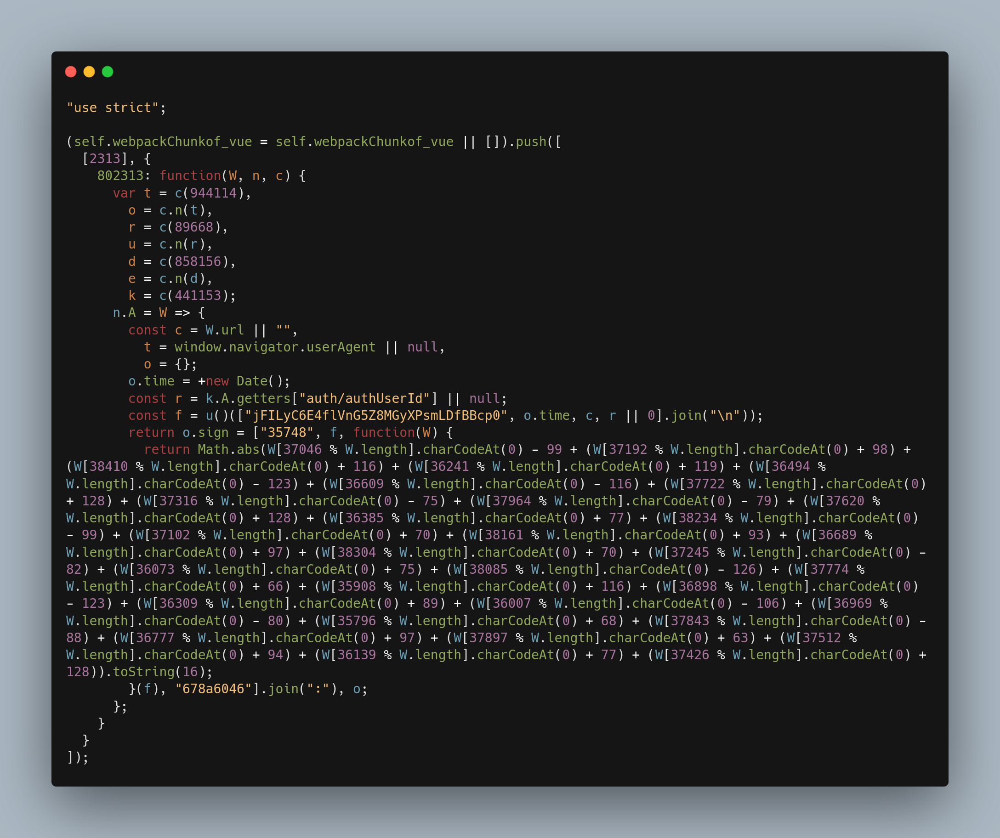

# onlyfans-deobfuscator [](https://github.com/amotrak/onlyfans-deobfuscator/actions)

A set of TypeScript tools to deobfuscate JavaScript code that OnlyFans uses to sign requests. It basically allows you to have always-updated so-called "dynamic rules" without using third-party services. For people interested specifically in AST deobfuscation I commented on the most difficult parts. Verified to be workable as of 2025-01-23.


_<center>The result of a deobfuscation</center>_

## Motivation
OnlyFans uses API protection, so the requests can't be simply replayed and modified with automation tools and curl. In all important requests (such as login, getting profile info), the `sign` header is used, which is a SHA-1 hashed string that is verified on the server side and is a combination of path/body/user_id and timestamp with the salt and some additional transformations (which are obfuscated), so the HTTP request is a valid only for a few minutes; the backend then refuses to accept it.

## Getting Started
Use [dynamic-rules.json](https://github.com/amotrak/test-repo/raw/refs/heads/main/dynamic-rules.json) which is automatically updated every 6 hours.

You can however clone the repo and use this tool locally with the next steps:

There are 3 scripts:
- fetch_script.sh to fetch obfuscated javascript to output directory
- deobfuscator.ts to process obfuscated code
- dynamic_rules.ts to generate "dynamic rules"

Run `npm install` and then compile TypeScript by running `npm run build`.

Run the following commands to fetch obfuscated script, deobfuscate it, and generate dynamics rules:
```shell
./fetch_script.sh <output_directory>
npm run deobfuscate <obfuscated_script> <deobfuscated_script>
npm run dynamic-rules <deobfuscated_script>
```

The output will be similar to this:
```
{"end":"678a6046","start":"35748","format":"35748:{}:{:x}:678a6046","prefix":"35748","suffix":"678a6046","static_param":"jFILyC6E4flVnG5Z8MGyXPsmLDfBBcp0","remove_headers":["user_id"],"checksum_indexes":[6,32,10,1,14,9,2,36,4,20,25,34,22,1,9,24,5,33,5,14,28,18,29,7,9,36,3,17,17,32,19,26],"checksum_constant":673}
```

### 3rd party libraries
- [Babel](https://babeljs.io/) to traverse and transform JS AST
- [js-beautify](https://github.com/beautifier/js-beautify)

### Additional
OnlyFans obfuscation is one of the least difficult obfuscations you will see in real-world websites, so it's a good way to learn how to use AST transformations to deobfuscate javascript.

A set of articles that may help you to understand how AST deobfuscation work https://steakenthusiast.github.io/categories/ and https://habr.com/ru/articles/720588/. Also read the official [babel-handbook](https://github.com/jamiebuilds/babel-handbook/) which will give you a deeper knowledge of available features.
